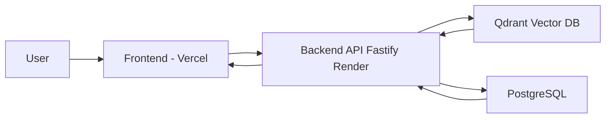

# 🚀 MentorOS

### AI-Powered University Assistant (RAG-Based System)

---

## 📌 Overview

MentorOS is an intelligent assistant designed to provide accurate answers based on university policies and documents.
It uses a **Retrieval-Augmented Generation (RAG)** architecture to ensure responses are grounded in real data instead of hallucinations.

---

## ✨ Features

* 🔍 Semantic search using vector embeddings
* 📄 PDF-based knowledge ingestion
* ⚡ Fast API responses using Fastify
* 🧠 AI-powered query understanding
* 🌐 Deployment-ready architecture

---

## 🧭 Architecture Diagram



---

## 🏗️ System Flow

```text
User → Frontend (Vercel)
     → Backend (Fastify - Render)
     → Qdrant (Vector Search)
     → PostgreSQL (Metadata)
```

> Embeddings are generated locally using Ollama and stored in the vector database.

---

## 🛠️ Tech Stack

### 💻 Frontend

* React / Next.js
* Vercel

### ⚙️ Backend

* Node.js
* Fastify

### 🗄️ Databases

* PostgreSQL
* Qdrant

### 🤖 AI / ML

* Ollama (used for embedding generation during ingestion)

---

## 📂 Project Structure

```text
MentorOS/
│── backend/
│── frontend/
│── docs/
│── .gitignore
│── .env.example
│── package.json
```

---

## 🔐 Environment Variables

Create a `.env` file inside the backend folder:

```bash
GEMINI_API_KEY=your_api_key_here
```

Example reference:

```bash
.env.example
```

---

## ⚙️ Installation & Setup

### 1️⃣ Clone repository

```bash
git clone https://github.com/your-username/MentorOS.git
cd MentorOS
```

### 2️⃣ Install dependencies

```bash
cd backend
npm install

cd ../frontend
npm install
```

### 3️⃣ Run locally

```bash
# Backend
cd backend
npm start

# Frontend
cd frontend
npm run dev
```

---

## 🚀 Deployment

* 🌐 Frontend → Vercel
* ⚙️ Backend → Render
* 🧠 Embeddings → Generated locally using Ollama

---

## 🧪 Demo Strategy

* Backend deployed (lightweight version for demonstration)
* Full system (DB + vector search + embeddings) runs locally
* Ensures stability during presentation

---

## 🎯 Key Highlights

* 📌 RAG-based accurate response system
* 📌 Vector database integration (Qdrant)
* 📌 Clean backend architecture
* 📌 Industry-level deployment approach

---

## 🔮 Future Improvements

* ☁️ Full cloud deployment (AWS / Docker)
* ⚡ Real-time ingestion pipeline
* 🧠 Advanced LLM integration
* 📊 Admin dashboard

---

## 👨‍💻 Author

**Mantosh Das and Anmol Madhav**

---

## ⭐ Support

If you found this project useful, consider giving it a ⭐ on GitHub!
